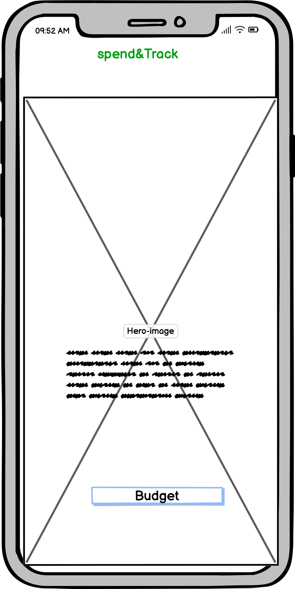
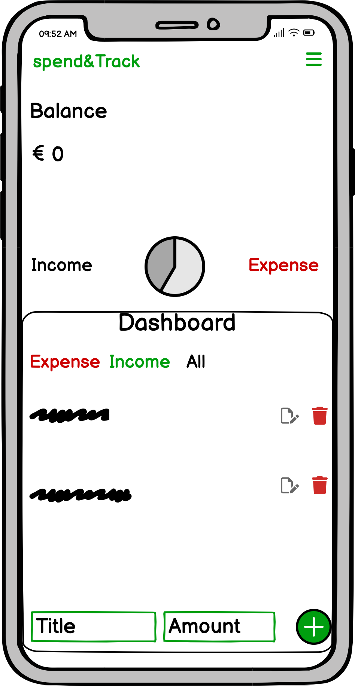
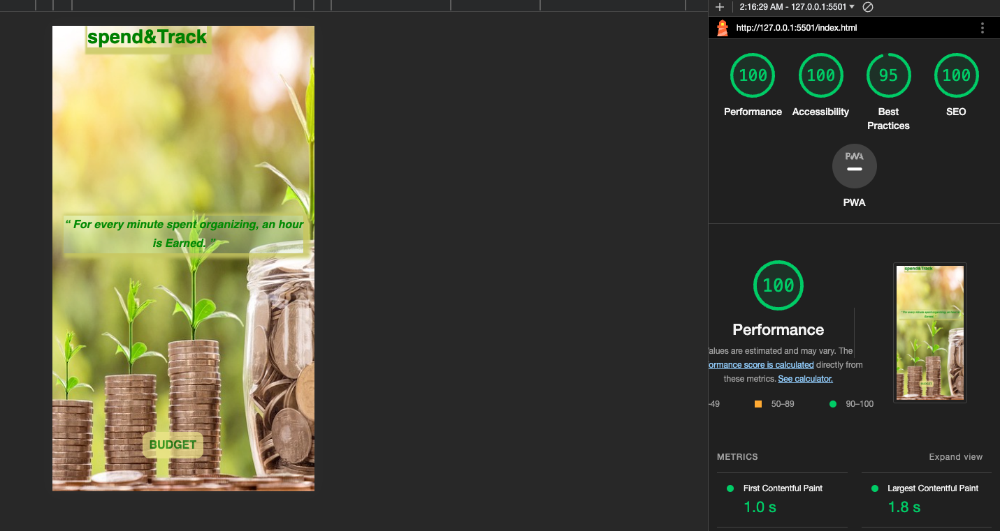

 <h1 align="center">Spend&Track</h1>

[View the live project here.](https://lateef-hub.github.io/Portfolio2/)

<P>Spend&Track is an expense tracker web application that allows users to track thier expense and also keep track of balance. It can be use by different user of different age. It's simple and straight forward. 

<h2 align="center"></h2>

## User Experience (UX)

-   ### User stories

    -   #### First Time Visitor Goals

        1. As a First Time Visitor, I want to easily understand the main purpose of the site and learn more about the application.
        2. As a First Time Visitor, I want to be able to easily navigate throughout the site to find a call to action button and menu.

    -   #### Returning Visitor Goals

        1. As a Returning Visitor, I want to find information about my previous entries.
        2. As a Returning Visitor, I want to be able to add more entry

    -   #### Frequent User Goals
        1. As a Frequent User, I want to check to see if new features are added.
        2. As a Frequent User, I want to check to see if the application now offers user account.
        3. As a Frequent User, I want to be able to add unlimited entries.

-   ### Design
    -   #### Colour Scheme
        -   The three main colours used are Green, White, and khaki.
    -   #### Typography
        -   The Montserrat font is the main font used throughout the whole website with Sans Serif as the fallback font in case for any reason the font isn't being imported into the site correctly. Montserrat is known for it's high readability, and ease of scaling make Montserrat a suitable typeface for printed material, such as brochures, signage and even books and for our app.
    -   #### Imagery
        -   Imagery is important. The large, background hero image is designed to be striking and catch the user's attention. It also has a motivation, energetic rewarding.
        -   The budget board color pallette are specially picked to show the understanding of expense tracking and a feel of hope and goals. 

## Features
  -   #### Navigation Bar:
       - Responsive on all devices
       - It makes the website easy for user to navigate
       - It is available on each pages of the website
       - Logo that can be use to navigate back to the homepage from anywhere on the site.
       
  -  #### Home Page:
       #### The home page consists of a section with there element:
       - The App title bar which serv link to the other pages on the website and Logo that be use to navigate back to the homepage from anywhere on the site.
       - The hero image section with full background image, a clear qoute about saving time by making plans, goals,  and mission.
       - The call to action section that link to budget page which user can use to navigate to launch the app.

  - #### Budget Page:
      - Budget page consists  of Budget header in which user can see Balance and Income and Outcome.
      - There's a Chart pie that indicate Income in White and Outcome in Red for user illustration.
      - Budget Dashboard where the entries are display in categories of three (Expense, Income, All)
      - It also has an input section where user can add transaction under two of the 3 category.

### Future Features 
- User will be able to sign up for a user account.

## Wireframes
-   Large Screen Wireframe
        - 
        

-   Mobile Screen Wireframe
        - 
        - 

## Technologies Used

- ### Languages Used
     -   [HTML5](https://en.wikipedia.org/wiki/HTML5)
     -   [CSS3](https://en.wikipedia.org/wiki/Cascading_Style_Sheets)
     -   [JavaScript ES6](http://es6-features.org/)
     -    ## Frameworks & Libraries
 
- ### Frameworks, Libraries & Programs Used
  1. [Google Fonts:](https://fonts.google.com/)
        - Google fonts were used to import the 'Lato' font into the style.css file which is used on all pages throughout the project.
  1. [Font Awesome:](https://fontawesome.com/)
        - Font Awesome was used on all pages throughout the website to add icons for aesthetic and UX purposes.
  1. [Balsamiq:](https://balsamiq.com/)
        - Balsamiq was used to create the [wireframes](https://github.com/) during the design process.
  1. [Canvas:](https://balsamiq.com/)
        - Canvas was used to create the Chart pie[wireframes](https://github.com/) during the design process.
      

 
## Testing
     
- ### Code validation
    The W3C Markup Validator and W3C CSS Validator Services were used to validate every page of the project to ensure there were no syntax errors in the project.
     - [W3C HTML Markup Validator](https://jigsaw.w3.org/css-validator/#validate_by_input) - 
     - [W3C CSS Validator](https://jigsaw.w3.org/css-validator/#validate_by_input) - 
     - [JS Hint ](https://jshint.com/) 
  
- ### Lighthouse  Validation
   - Lighthouse report generator was used to validate the Performance, SEO, Accesibility, Best Practices for mobile and desktop.
     
      

-  ### Test cases (user story based with screenshots)
      
      -   #### First Time Visitor Goals

    1. As a First Time Visitor, I want to easily understand the main purpose of the site and learn more about the application.

        1. Upon entering the site, users are automatically greeted with a clean and easily readable homepage call to action button to direct budget page to go to the page of their application. Underneath there is a Hero Image with Text that states the mission goal of the app     .
        2. The main points are made immediately with the hero image that this is a an expenditure and expense tracker application website.
        3. The user has one options on arrival, click the call to action button in the bottom, then on the secone page, the use will be able to navigate to the homepage and back.
        4. User can click on the nav bar to see a menu of Analytics and Dashboard

    2. As a First Time Visitor, I want to be able to easily be able to navigate throughout the site to find content.

        1. The site has been designed to be fluid and never to entrap the user. At the bottom of the first page there is a call to action button, to take the user to the main page where they start budgeting
        2. At the top of the second page there is a navigation bar with two optiond (Analytics and Dashboard) there also the logo to your left it's linked directly to the homepage to ensure the user always has somewhere to go and doesn't feel trapped as they get to the bottom of the page.
        - Call to Action first and last page
         
        

-   #### Returning Visitor Goals

    1. As a Returning Visitor, I want to find the new menu added.

        1. These are clearly shown in the banner message.
        2. They will be directed to a page with another hero image and call to action.

    2. As a Returning Visitor, I want to find the best way to get in contact with the organisation with any questions I may have.

        1. The navigation bar clearly highlights the "Contact Us" Page.
        2. Here they can fill out the form on the page or are told that alternatively they can message the organisation on social media.
        3. The footer contains links to the organisations Facebook, Snapchat and Instagram page.
        4. Whichever link they click, it will be open up in a new tab to ensure the user can easily get back to the website.
        5. The email button is set up to automatically open up your email app and autofill there email address in the "To" section.

    3. As a Returning Visitor, I want to find the Facebook Group link so that I can join and interact with others in the community.
        1. The Facebook Page can be found at the footer of every page and will open a new tab for the user and more information can be found on the Facebook page.
        ### Fixed Bugs

        - The responsiveness of the page on iPad screen was a little bit bad and needed alignment
        - I had issues with my handlers in while working on Javascript and I was able to fix it by retracing my code
        
-  ## Supported Screens and Browsers

       
    ### Further Testing

   -   The Website was tested on Google Chrome, Internet Explorer, Mozilla Firefox, Microsoft Edge and Safari browsers.
   -   The website was viewed on a variety of devices such as Desktop, Laptop, iPhone xr,   Samsung Tablet, iPhone 12 & iPhoneX.
   -   A large amount of testing was done to ensure that all pages were linking correctly.
   -   Friends and family members were asked to review the site and documentation to point out any bugs and/or user experience issues.
## Deployment

### GitHub Pages

The project was deployed to GitHub Pages using the following steps...

1. Log in to GitHub and locate the [GitHub Repository](https://github.com/)
2. At the top of the Repository (not top of page), locate the "Settings" Button on the menu.
    - Alternatively Click [Here](https://raw.githubusercontent.com/) for a GIF demonstrating the process starting from Step 2.
3. Scroll down the Settings page until you locate the "GitHub Pages" Section.
4. Under "Source", click the dropdown called "None" and select "Master Branch".
5. The page will automatically refresh.
6. Scroll back down through the page to locate the now published site [link](https://github.com) in the "GitHub Pages" section.

### Forking the GitHub Repository

By forking the GitHub Repository we make a copy of the original repository on our GitHub account to view and/or make changes without affecting the original repository by using the following steps...

1. Log in to GitHub and locate the [GitHub Repository](https://github.com/)
2. At the top of the Repository (not top of page) just above the "Settings" Button on the menu, locate the "Fork" Button.
3. You should now have a copy of the original repository in your GitHub account.

### Making a Local Clone

1. Log in to GitHub and locate the [GitHub Repository](https://github.com/)
2. Under the repository name, click "Clone or download".
3. To clone the repository using HTTPS, under "Clone with HTTPS", copy the link.
4. Open Git Bash
5. Change the current working directory to the location where you want the cloned directory to be made.
6. Type `git clone`, and then paste the URL you copied in Step 3.

```
$ git clone https://github.com/YOUR-USERNAME/YOUR-REPOSITORY
```

7. Press Enter. Your local clone will be created.

```
$ git clone https://github.com/YOUR-USERNAME/YOUR-REPOSITORY
> Cloning into `CI-Clone`...
> remote: Counting objects: 10, done.
> remote: Compressing objects: 100% (8/8), done.
> remove: Total 10 (delta 1), reused 10 (delta 1)
> Unpacking objects: 100% (10/10), done.
```

Click [Here](https://help.github.com/en/github/creating-cloning-and-archiving-repositories/cloning-a-repository#cloning-a-repository-to-github-desktop) to retrieve pictures for some of the buttons and more detailed explanations of the above process.


## Credits

  ### Code

-   The full-screen hero image code came from this [Wttw post](https://interactive.wttw.com/playlist/2022/10/13/dozzys-grill)

### Content

-   All content was written by the developer.

-   Psychological properties of colours text in the README.md was found [here](http://www.colour-affects.co.uk/psychological-properties-of-colours)

### Media

-   All Images were created by the developer.

### Acknowledgements

-   My Mentor for continuous helpful feedback.
 
-   Tutor support at Code Institute for their support.
  
-   Kevin Powell CSS Tutorial Class (Youtube)
